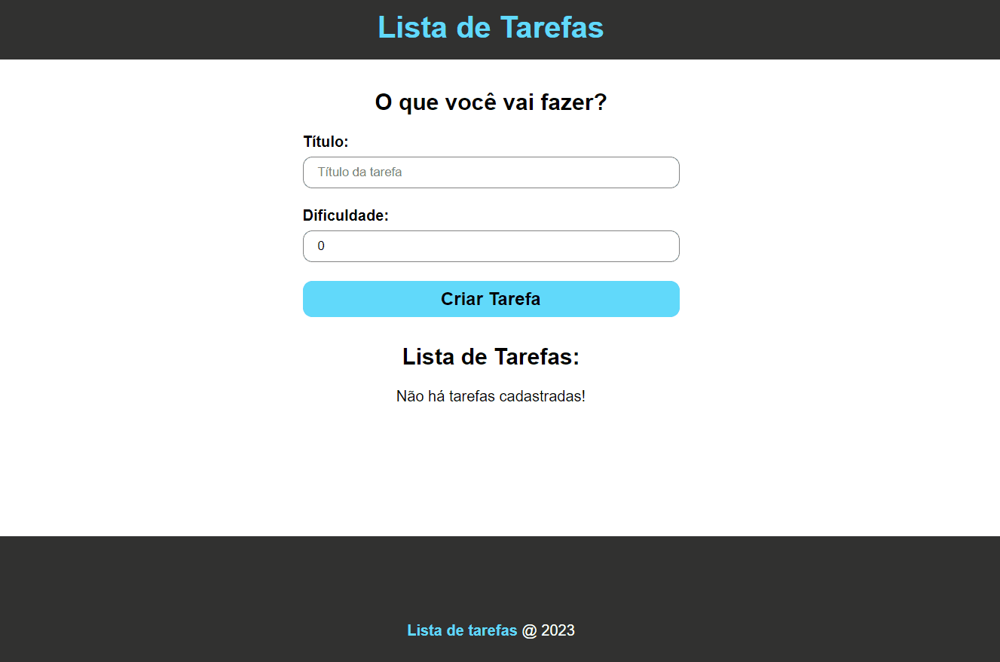

# TO DO LIST

## 🔗[Acesse Aqui o Projeto!](https://thasyo.github.io/to-do-list/)

## Preview do Projeto

### 📃 Descrição 📃

- Objetivo

    - O objetivo deste projeto é auxiliar o usuário na organização de suas tarefas através de uma simples lista de tarefas.

- Propósito

    - O propósito deste projeto foi exclusivamente para desenvolver os meus estudos, praticando e concretizando os meus conhecimentos em React e Typescript.

### 📉 Funcionalidades 📈

- Neste projeto, estão incluídos os fundamentos do CRUD (Create, Read, Update and Delete).

    - Criação de tarefas
    - Leitura das tarefas criadas
    - Função de atualização das tarefas criadas
    - Função de Exclusão das Tarefas criadas

### 🛠️ Tecnologias 🛠️

- REACT
- TYPESCRIPT
- CSS
- GIT
- GITHUB
- VSCODE

### 👨‍💻 Status do Projeto 👨‍💻

- Finalizado com Sucesso! ✔️

## 🛑 Não pare por aqui! 🛑

- Gostou do meu projeto? Então me acompanhe no LinkedIn, para ficar por dentro das minhas últimas aplicações! 😉

- [Linkedin](https://www.linkedin.com/in/thasyo-peres-63aa27235/)